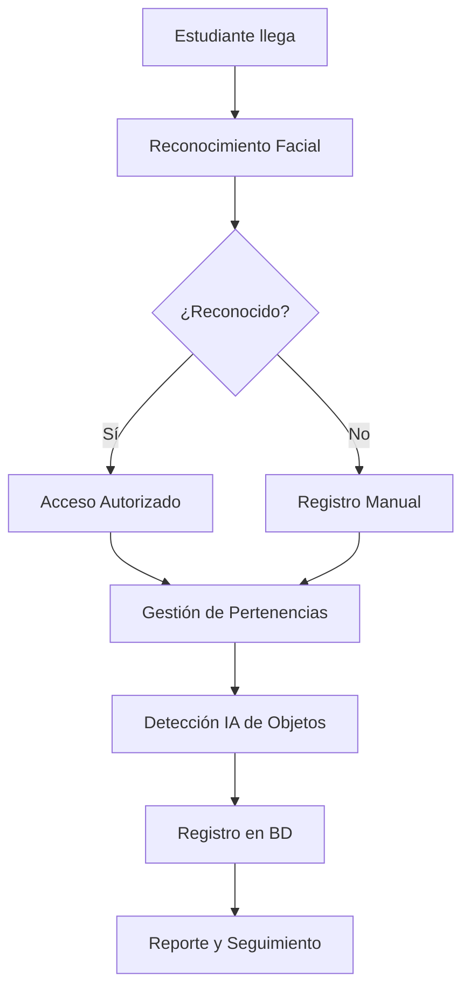

# 🎓 IntelliGuard IA

Sistema inteligente de **reconocimiento facial** y **gestión de pertenencias** para instituciones educativas, desarrollado con tecnologías de Inteligencia Artificial.

## 🌟 Características Principales

- 🔍 **Reconocimiento Facial en Tiempo Real**: Identifica estudiantes automáticamente
- 📦 **Gestión Inteligente de Pertenencias**: Registra y controla objetos personales
- 🤖 **Detección de Objetos con IA**: Tecnología YOLO para clasificación automática
- 📊 **Sistema de Reportes**: Consultas y estadísticas detalladas
- 🎯 **Interfaz Intuitiva**: Diseño moderno y fácil de usar
- 🔒 **Seguridad**: Sistema de autenticación y control de acceso

## 🚀 Cómo Usar la Demo

### 1. 👤 Registro de Estudiantes

- Ingresa el código único del estudiante
- Toma una foto clara del rostro (buena iluminación, sin lentes oscuros)
- El sistema procesará y almacenará la información facial

### 2. 🔍 Reconocimiento Facial

- Captura una foto del estudiante a identificar
- La IA comparará con la base de datos
- Obtendrás el resultado con nivel de confianza

### 3. 📦 Gestión de Pertenencias

- Selecciona el tipo de objeto (laptop, teléfono, etc.)
- Toma una foto del objeto
- El sistema detectará automáticamente las características
- Registrará la pertenencia asociada al estudiante

### 4. 🤖 Detección de Objetos IA

- Sube cualquier imagen
- La IA detectará y clasificará objetos automáticamente
- Mostrará coordenadas y nivel de confianza

### 5. 📊 Consultas y Reportes

- Lista estudiantes registrados
- Consulta pertenencias por estudiante
- Genera reportes estadísticos del sistema

## 🛠️ Tecnologías Utilizadas

- **Frontend**: Gradio 4.44.0
- **Computer Vision**: OpenCV, face-recognition
- **IA/ML**: PyTorch, YOLO (ultralytics)
- **Base de Datos**: SQLite (demo), PostgreSQL (producción)
- **Backend**: Flask, Python
- **Reportes**: ReportLab, Pandas

## 🎯 Casos de Uso

### 📚 Instituciones Educativas

- Control de acceso a laboratorios
- Gestión de equipos prestados
- Seguridad en bibliotecas
- Registro de pertenencias en dormitorios

### 🏢 Empresas y Oficinas

- Control de activos tecnológicos
- Gestión de préstamos de equipos
- Seguridad en áreas restringidas

### 🏥 Centros de Salud

- Control de equipos médicos
- Gestión de pertenencias de pacientes
- Acceso a áreas especializadas

## 📈 Beneficios

- ✅ **Automatización**: Reduce trabajo manual del personal
- ✅ **Seguridad**: Previene pérdidas y robos
- ✅ **Trazabilidad**: Historial completo de movimientos
- ✅ **Eficiencia**: Procesos más rápidos y confiables
- ✅ **Escalabilidad**: Crece con la institución

## 🔧 Versión Demo vs Producción

### 🌐 Esta Demo (Hugging Face Spaces)

- ✅ Interfaz completa y funcional
- ✅ Reconocimiento facial básico
- ✅ Detección de objetos simulada
- ✅ Base de datos SQLite
- ✅ Ideal para pruebas y evaluación

### 🏭 Versión de Producción

- 🚀 PostgreSQL para mayor robustez
- 🚀 Modelos de IA entrenados específicamente
- 🚀 API REST completa
- 🚀 Autenticación avanzada
- 🚀 Reportes en PDF/Excel
- 🚀 Escalabilidad horizontal

## 📊 Flujo de Trabajo

## 🎮 Prueba la Demo

1. **Registra un estudiante** con su foto
2. **Verifica el reconocimiento** facial
3. **Registra pertenencias** con detección IA
4. **Explora las consultas** y reportes
5. **Experimenta** con la detección de objetos

## 💡 Notas Importantes

- 📝 Esta es una **versión de demostración** con funcionalidades simplificadas
- 🔄 Los datos se almacenan temporalmente (se resetean al reiniciar)
- 🎯 Para implementación en producción, contacta al equipo de desarrollo
- 🛡️ Cumple con estándares de privacidad y protección de datos

## 🤝 Contribuir

¿Interesado en mejorar IntelliGuard IA?

- 📧 Reporta bugs o sugiere mejoras
- 🔧 Contribuye con código
- 📚 Mejora la documentación
- 🧪 Ayuda con pruebas

## 📞 Contacto y Soporte

Para implementación en tu institución o consultas técnicas:

- 📧 Email: [tu-email@ejemplo.com]
- 💬 Issues: GitHub Repository
- 📱 Demo: Esta aplicación en Hugging Face Spaces

---

🚀 **¡Experimenta con IntelliGuard IA y descubre el futuro de la gestión educativa inteligente!**
